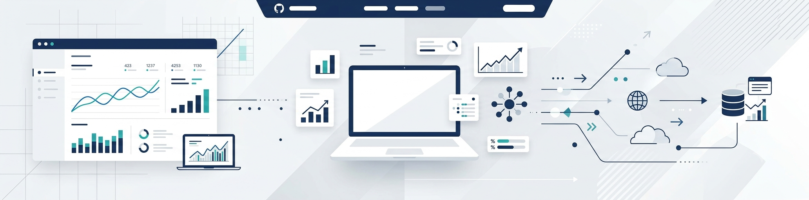

<h1>Hi, I'm Sadhvi Bedi 👋</h1>

---

### 👩‍💻 About Me

I'm a fresh graduate with a **BA (Hons) in Computer Application, with a minor in Mathematics**. My academic background gave me a strong foundation in logical thinking, problem-solving, and working with numbers — and I've realized that what excites me most is turning raw data into insights that actually help people make decisions. That's what's pulling me toward a career as a **Data Analyst / Business Analyst**.

I'm currently building up my practical skills through hands-on projects and self-learning, one dataset at a time.

---

### 📚 Currently Learning

- 🐍 Python  
- 🗃️ SQL  
- 📊 Power BI  
- 📈 Excel  
- 📐 Statistics  
- 🤖 Machine Learning Fundamentals  

---

### 🛠️ Tools & Tech

**Data Analysis:** Python · Pandas · SQL  
**Visualization:** Power BI · Excel  
**Foundations:** Statistics · Machine Learning Basics  

---

### 📂 Projects / Case Studies

**🍷 Red Wine Quality Analysis**
- **Business Problem:** Understand which physicochemical properties most influence the quality rating of red wine.
- **Approach:** Explored and cleaned the dataset, analyzed correlations between variables, and built visualizations to identify the strongest quality indicators.
- **Tools Used:** Python, Pandas, Statistics

**🎬 Netflix Data Analysis**
- **Business Problem:** Explore trends in Netflix's content library — such as genre distribution, content growth over time, and regional patterns.
- **Approach:** Cleaned and analyzed the dataset, then built visualizations to surface trends and patterns in content type, release year, and country of origin.
- **Tools Used:** Python, Pandas, Data Visualization

---

### 📊 GitHub Stats

---

### 🎯 Open To

Internships and entry-level opportunities as a **Data Analyst / Business Analyst**.

---

### 🤝 Connect With Me

